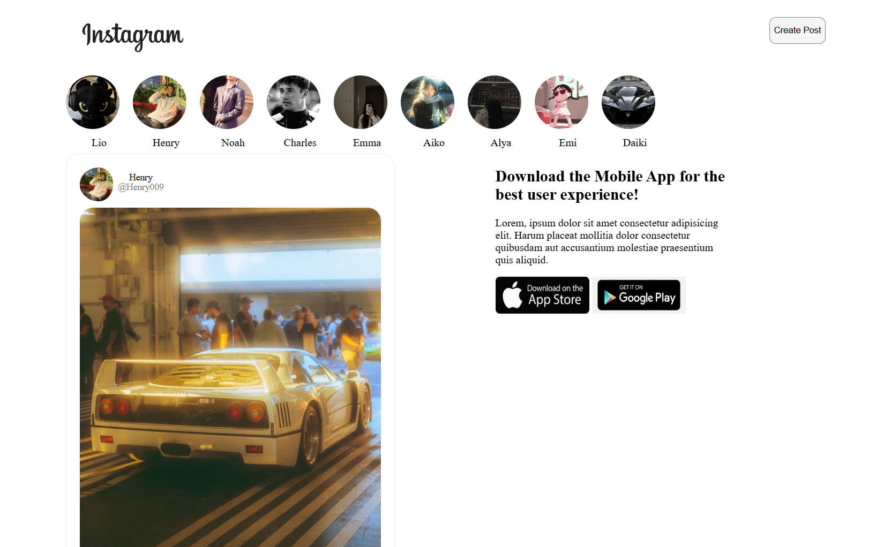
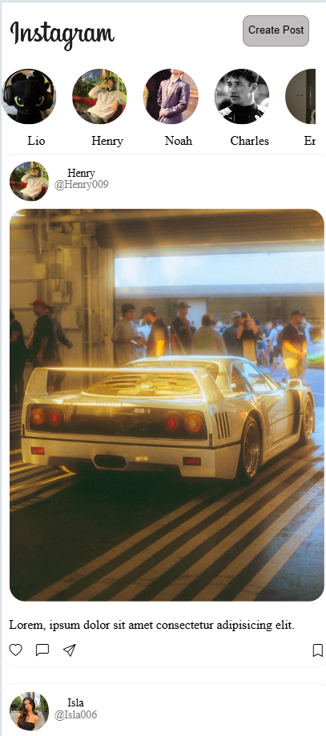

# Instagram Clone 🟣

A responsive front-end clone of Instagram built using **HTML** and **CSS**. This project replicates key parts of Instagram’s UI, including stories, posts, profile thumbnails, and basic interactivity styling.

🔗 [View the Project on GitHub](https://github.com/Munazz-a/instagram-clone)

## 💡 Features

- Responsive design (mobile + desktop)
- Header with logo and login button
- Scrollable story section with circular profile pictures
- Posts with user info, image, and reactions layout

## 🧰 Tech Stack

- HTML5
- CSS3 (Flexbox, Media Queries)

📁 Project Structure
  
instagram-clone/
├── index.html    
└── style.css

## 📸 Screenshots

### 💻 Desktop View

### 📱 Mobile View

🚀 How to Run Locally

1. Clone the repository:
git clone https://github.com/Munazz-a/instagram-clone.git

2.Open the folder:
cd instagram-clone

3. Launch the index.html file in your browser (double-click or right-click > "Open with browser").

🙋‍♀️ Author
  Munazza Sultana
 📍 3rd Year Engineering Student.

📜 License
This project is intended for educational and learning purposes only.
